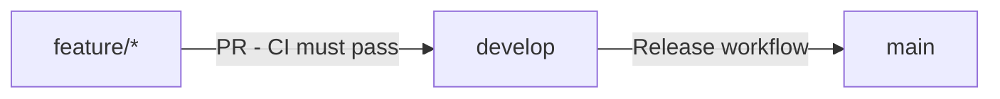

# Contributing to screeningServ

> 📖 See [AGENTS.md](AGENTS.md) for pre-commit guidelines and local testing requirements.

## Branching Strategy

We use a three-tier branching model:

- `main` - Production branch. Only receives code via release PRs from develop.
- `develop` - Integration branch. Receives code via PRs from feature branches.
- `feature/*` - Feature branches. Can be pushed to directly.



## Branch Protection Rules

### main branch

- Requires PR before merging
- Requires 1 approval
- Requires `build` status check to pass
- Requires linear history (squash merge only)
- No force pushes
- No deletions

### develop branch

- Requires PR before merging
- Requires `build` status check to pass
- Requires 1 approval (CI must pass before approval is possible)
- No force pushes
- No deletions

### feature branches

- No protection - push freely

## Development Workflow

1. Create feature branch from develop:
   ```bash
   git checkout develop && git pull && git checkout -b feature/my-feature
   ```

2. Make changes

3. **Test locally before pushing:**
   ```bash
   ./mvnw verify
   ```
   
   > ⚠️ **Do not push if this fails.** Fix all issues first. See `AGENTS.md` for pre-commit guidelines.

4. Commit with meaningful message (see `AGENTS.md` for conventions)

5. Push feature branch:
   ```bash
   git push -u origin feature/my-feature
   ```

6. Create PR to develop:
   ```bash
   gh pr create --base develop
   ```

7. Wait for CI to pass (Maven build + test)

   Note: CI must pass before a PR can be approved or merged. This ensures only tested code gets reviewed.

8. Request review and get approval (required for all PRs)

9. Merge the PR (squash merge recommended)

10. Branch auto-deletes after merge

## CI Pipeline

### Build & Test (`ci.yml`)

- **Triggers**: PR to develop/main, push to develop
- **Runner**: ubuntu-latest
- **Java**: JDK 25 (Temurin)
- **Cache**: Maven dependencies for faster builds
- **Command**: `./mvnw verify` (compile + test + SpotBugs)
- **Job name**: `build` (referenced in branch protection rules)

### Code Quality (`sonarcloud.yml`)

SonarCloud analysis for code quality and security:

- **Triggers**: Push/PR to develop/main
- **Analysis**: Bugs, vulnerabilities, code smells, coverage
- **Free for**: Public repositories
- **Dashboard**: https://sonarcloud.io/project/overview?id=ptek26_screeningServ

### Dependency Updates (Dependabot)

- **Maven deps**: Weekly checks on Mondays at 06:00 UTC
- **GitHub Actions**: Weekly checks on Mondays at 06:00 UTC
- **Auto-creates PRs** for dependency updates
- **Labels**: `dependencies` for tracking

### Release CI (`release-ci.yml`)

Runs before every release to production:

- **Triggers**: Called by Release workflow
- **Jobs**:
  - `build-and-test`: Maven verify (compile + test + SpotBugs)
  - `security-scan`: Trivy vulnerability scanner (CRITICAL/HIGH fails)
- **Fast**: Completes in ~2-3 minutes

## Release Process

### Prerequisites

- All features merged to `develop`
- QA completed on `develop`
- CI passing on `develop`

### Release Steps

1. Go to **Actions** → **Release** → **Run workflow**
2. Enter version number (semver: X.Y.Z, e.g., `1.0.0`)
3. Click **Run workflow**

The workflow will:

1. Validate version format
2. Run Release CI (build + test + OWASP security scan)
3. **Pause for manual approval** (GitHub Environment)
4. After approval: merge `develop` → `main`, create tag, publish GitHub Release

### Manual Approval

Releases require approval via the `release` GitHub Environment:

1. Go to **Actions** → find the running Release workflow
2. Click **Review deployments**
3. Select the `release` environment
4. Add comments (optional) and click **Approve** or **Reject**

This approval gate replaces the need for PR approvals on `main` for releases.

### Branch Protection on Main

The `main` branch has relaxed PR requirements for releases:

| Protection | Status |
|------------|--------|
| Require PR before merging | ❌ Disabled (releases push directly) |
| Require linear history | ✅ Enabled |
| Require status checks | ✅ Enabled (`build`) |
| Block force pushes | ✅ Enabled |
| Block deletions | ✅ Enabled |

**Why no PR requirement?** The `release` environment approval provides the human-in-the-loop gate. CI still validates all code before and after release.

### Security Scan

Trivy scans dependencies for known vulnerabilities (CVEs):

- Fails on CRITICAL or HIGH severity issues
- Scans filesystem including dependencies
- Fast execution (~30-60 seconds)
- Free for public repositories

### Release Branches

Releases do NOT create separate branches. The workflow:

- Merges `develop` directly into `main` (merge commit)
- Creates a tag on `main` (e.g., `v1.0.0`)
- Creates a GitHub Release with auto-generated notes

### Dry Run

There is no dry-run mode. Test changes thoroughly on `develop` before triggering a release.

## Repository Settings

| Setting | Value |
|---------|-------|
| Default branch | `develop` |
| Merge method | Squash only |
| Auto-delete branches | Enabled |
| Auto-merge | Enabled |

## Getting Started

```bash
# Clone
git clone https://github.com/ptek26/screeningServ.git
cd screeningServ

# Build
./mvnw verify

# Create feature branch
git checkout develop
git pull
git checkout -b feature/my-feature
```