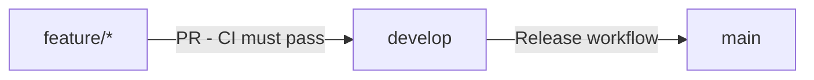

# Contributing to screeningServ

> 📖 See [AGENTS.md](AGENTS.md) for pre-commit guidelines and local testing requirements.

## Branching Strategy

We use a three-tier branching model:

- `main` - Production branch. Only receives code via release PRs from develop.
- `develop` - Integration branch. Receives code via PRs from feature branches.
- `feature/*` - Feature branches. Can be pushed to directly.



## Branch Protection Rules

### main branch

- Requires PR before merging
- Requires 1 approval
- Requires `build` status check to pass
- Requires linear history (squash merge only)
- No force pushes
- No deletions

### develop branch

- Requires PR before merging
- Requires `build` status check to pass
- Requires 1 approval (CI must pass before approval is possible)
- No force pushes
- No deletions

### feature branches

- No protection - push freely

## Development Workflow

1. Create feature branch from develop:
   ```bash
   git checkout develop && git pull && git checkout -b feature/my-feature
   ```

2. Make changes

3. **Test locally before pushing:**
   ```bash
   ./mvnw verify
   ```
   
   > ⚠️ **Do not push if this fails.** Fix all issues first. See `AGENTS.md` for pre-commit guidelines.

4. Commit with meaningful message (see `AGENTS.md` for conventions)

5. Push feature branch:
   ```bash
   git push -u origin feature/my-feature
   ```

6. Create PR to develop:
   ```bash
   gh pr create --base develop
   ```

7. Wait for CI to pass (Maven build + test)

   Note: CI must pass before a PR can be approved or merged. This ensures only tested code gets reviewed.

8. Request review and get approval (required for all PRs)

9. Merge the PR (squash merge recommended)

10. Branch auto-deletes after merge

## CI Pipeline

### Build & Test (`ci.yml`)

- **Triggers**: PR to develop/main, push to develop
- **Runner**: ubuntu-latest
- **Java**: JDK 25 (Temurin)
- **Cache**: Maven dependencies for faster builds
- **Command**: `./mvnw verify` (compile + test + SpotBugs)
- **Job name**: `build` (referenced in branch protection rules)

### Security Scanning (`codeql.yml`)

- **Triggers**: Push/PR to develop/main, weekly schedule
- **Language**: Java/Kotlin
- **Purpose**: Detects security vulnerabilities and coding errors
- **Free for**: Public repositories

### Dependency Updates (Dependabot)

- **Maven deps**: Weekly checks on Mondays at 06:00 UTC
- **GitHub Actions**: Weekly checks on Mondays at 06:00 UTC
- **Auto-creates PRs** for dependency updates
- **Labels**: `dependencies` for tracking

## Release Process

### Manual Release

1. Go to **Actions** → **Release** → **Run workflow**
2. Enter version number (semver: X.Y.Z)
3. Optionally enable dry-run to create PR without auto-merge
4. Workflow creates `release/vX.Y.Z` branch from develop
5. Creates PR from release branch to main
6. Enables auto-merge (waits for CI to pass)
7. Once merged, `release-tag.yml` automatically:
   - Creates git tag `vX.Y.Z`
   - Creates GitHub Release with auto-generated notes

### Dry Run

Set `dry_run: true` to test the release process without auto-merging. This creates the release PR but requires manual merge approval.

## Repository Settings

| Setting | Value |
|---------|-------|
| Default branch | `develop` |
| Merge method | Squash only |
| Auto-delete branches | Enabled |
| Auto-merge | Enabled |

## Getting Started

```bash
# Clone
git clone https://github.com/ptek26/screeningServ.git
cd screeningServ

# Build
./mvnw verify

# Create feature branch
git checkout develop
git pull
git checkout -b feature/my-feature
```